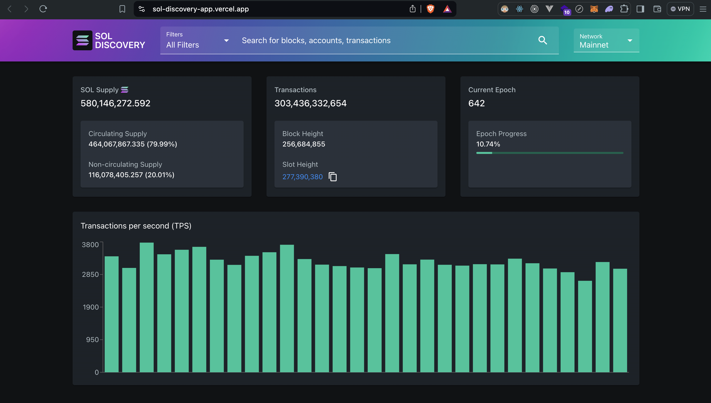
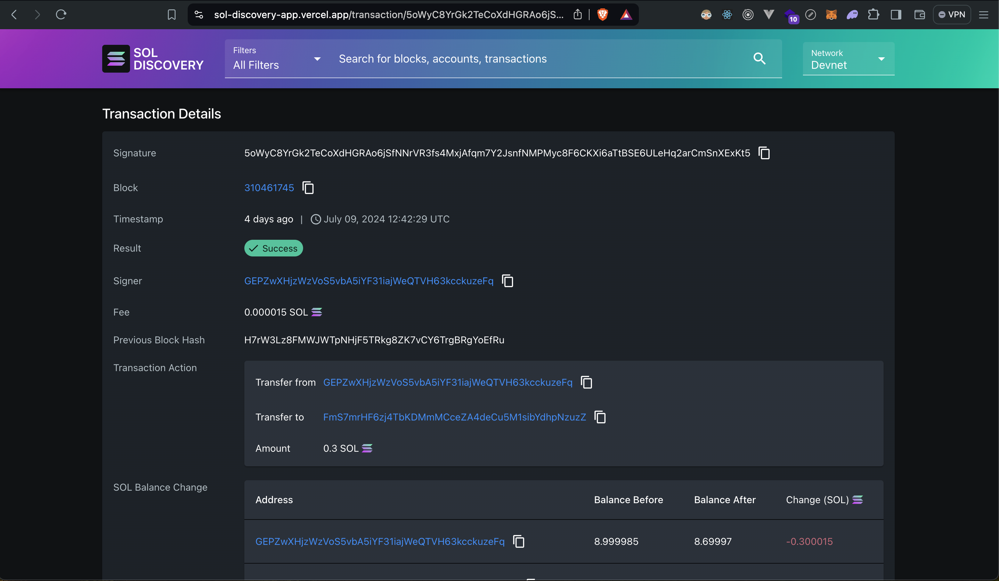
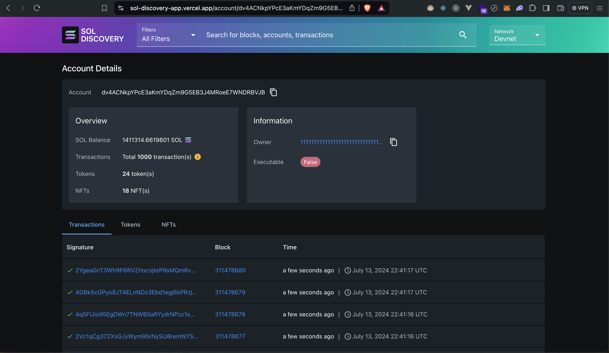
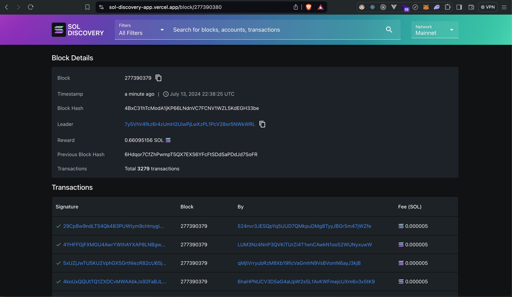

# SOL DISCOVERY

## [Live link of the project](https://sol-discovery-app.vercel.app/)

SOL DISCOVERY is a Solana explorer/dashboard application developed for the [Solana Talent Olympics Summer 2024](https://earn.superteam.fun/talent-olympics/) - Tooling Data Explorer/Dashboard category.

It allows you to search and analyse important Solana data, such as transaction, network, account, and block information in detail. Additionally, it supports connections to both Mainnet Beta and Devnet. Alchemy and Helius APIs are used for the necessary data.

Screenshots of the pages in the project are attached at the bottom of this document.

To set up the project locally, you need the tool [Node.js](https://nodejs.org/en).

After cloning the project, run the `npm install` command in the root directory.

To ensure the data fetch operations in the project work, create a file named `.env.local` in the root directory and set two environment variables within it:

ALCHEMY_SOLANA_KEY=<[Your API key from Alchemy](https://www.alchemy.com/)>   
HELIUS_SOLANA_KEY=<[Your API key from Helius](https://www.helius.dev/)>

Then, to run the project, use the `npm run dev` command.

If you want to build the project and run the built version, use the `npm run build` and `npm start` commands, respectively.

## Technologies
* React
* Next.js
* TypeScript
* Material UI

